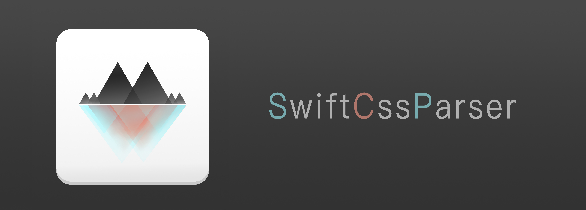
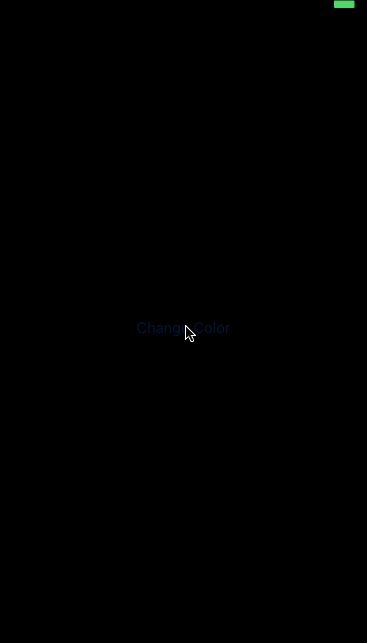

 
 

  

A Powerful , Extensible CSS Parser written in pure Swift.

## Basic Usage

From CSS:

~~~css
#View {
 "width" : 118;
 "height" : 120.5;
 "color1" : "#888888";
 "color2" : RGB(200,200,200);
 "color3" : RGB(200,200,200,0.5);
 "font1" : "Helvetica-Bold" 18;
 "font2" : "Cochin";
 "size" : 10 10;
 }
~~~

To Cocoa:

~~~swift
let width = css.int(selector: "#View", key: "width") // Int
let height = css.double(selector: "#View", key: "height") //Double
let color1 = css.color(selector: "#View", key: "color1") //UIColor
let font1  = css.font(selector: "#View", key: "font1") //UIFont
let font2 = css.font(selector: "#View", key: "font2", fontSize: 14) //UIFont
let size = testSwiftCSS.size(selector: "#View", key: "size") //CGsize
~~~

It's very easy to setup and parse CSS with `SwiftCssParser`:

~~~~swift
//1.Get CSS file path
let path = Bundle.main.url(forResource: "cssFileNmae", withExtension: "css")
//2.Get parsed CSS
let css = SwiftCSS(CssFileURL: path)
//3.Use it
let width = css.int(selector: "#View", key: "width")
~~~~

## Extension

It's very easy to build your own Powerful, Flexiable CSS based solutions base on `SwiftCssParser`.

#### Example1: `SwiftDeviceCss`

​	In most cases, `Auto Layout` can help us calculates the size and location of our views. But in some cases, we need to set specifc size and location for our views based on device type (device's screen size) to accomplish the `Pixel Perfect` design.

​	So, we can use `SwiftCssParser` to get layout value from CSS file. Different Device has different configuration file.

~~~swift
public let SwiftDeviceCss = SwiftCssStyleSheet.deviceCss()

class SwiftCssStyleSheet {
    
    private enum ScreenSize {
        case _320_480 //iPhone4 etc.
        case _320_568 //iPhone5 etc.
        //iPhone6....
    }
    
    static private let screenSize: ScreenSize = {
        let screen = UIScreen.main
        let size = UIScreen.main.fixedCoordinateSpace.bounds.size
        switch (size.width,size.height) {
        case (320,640):
        	return ._320_480
        //......
        }
    }()
    
    static func deviceCss() -> SwiftCSS {
        switch self.screenSize {
        case ._320_480:
            return SwiftCSS(CssFileURL: URL.CssURL(name: "iPhone4"))
        case ._320_568:
            return SwiftCSS(CssFileURL: URL.CssURL(name: "iPhone5"))
        //......
        }
    }
    
}
~~~

Then just layout: 

~~~swift
view.frame.size = SwiftDeviceCss.size(selector: "#View", key: "size")
~~~

#### Exeample2: `SwiftCssTheme`

We can also create a powerful theme manager base on `SwiftCssParser`.

For example, we want to create a night & day theme.

~~~swift
public class SwiftCssTheme {
    
    public static let updateThemeNotification = Notification.Name("SwiftCSSThemeUpdate")
    
    public enum Theme {
        case day
        case night
    }
    
    public static var theme: Theme = .day {
        didSet {
            switch theme {
            case .day:
                self.themeCSS = SwiftCSS(CssFileURL: URL.CssURL(name: "day"))
            case .night:
                self.themeCSS = SwiftCSS(CssFileURL: URL.CssURL(name: "night"))
            }
            NotificationCenter.default.post(name: updateThemeNotification, object: nil)
        }
    }
    
    public static var themeCSS = SwiftCSS(CssFileURL: URL.CssURL(name: "day"))
}
~~~

If we want to be able to dynamically modify the background color of UIView:

~~~swift
extension UIView {
    
    private struct AssociatedKeys {
        static var selector = "themeColorSelector"
        static var key = "themeColorKey"
    }
    
    var backgroundColorCSS: (selector: String,key: String) {
        get {
        	let selector = //Use objc_getAssociatedObject to get value.....
        	let key = //.....
            return (selector,key)
        }
        
        set {
            let selector = newValue.selector
            let key = newValue.key
            
            //Use objc_setAssociatedObject to set value......   
            
            NotificationCenter.default.addObserver(self, selector: #selector(_cssUpdateBackgroundColor), name: SwiftCssTheme.updateThemeNotification, object: nil)
            
            _cssUpdateBackgroundColor()
        }
    }
    
    private dynamic func _cssUpdateBackgroundColor() {
        self.backgroundColor = SwiftCssTheme.themeCSS.color(selector: self.backgroundColorCSS.selector, key: self.backgroundColorCSS.key)
    }
}
~~~

Then, we just need to specify the background color's  CSS selector and key:

~~~swift
self.view.backgroundColorCSS = ("#View","color")
~~~

Changing theme is even easier:

~~~swift
@IBAction func changeColor(_ sender: UIButton) {
    if SwiftCssTheme.theme == .day {
        SwiftCssTheme.theme = .night
    } else {
        SwiftCssTheme.theme = .day
    }
}
~~~

All the code and demo can be found in the project. Feel free to download and experiment.  Advice and pull requests are welcome.

## License

`SwiftCssParser` is under the MIT license.
